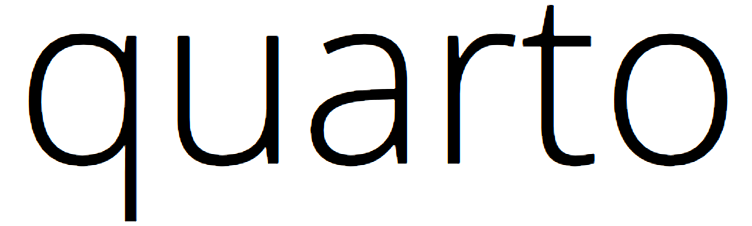

[

](https://huangweiran.club)

Quarto is a toy-level, self-implemented deep learning library with autograd.

## Content

Quarto is now under planning. Similar to PyTorch, in the first stage, we will implement:

1. A Tensor module. There should be a Tensor class based on NumPy array.
2. An `autograd` module.
3. Layers. A base Layer class, and some common layers, e.g, `conv2d`. (should beLealongs to `nn` module)
4. Functional. (should belongs to `nn` module)
5. init. (should belongs to `nn` module)

## Todo
1. Learn about reverse-mode autograd.
2. Learn about static typing in Python with `mypy`.

## Misc

Before really diving into this Quarto project, I decided to finish a simple warm-up project: implementing a DNN model for MNIST handwritten digit recognition with pure Python. By doing this, I believe I will understand deeper about the big picture of the Quarto library. On the other hand, doing deep learning without any autograd tools is kind of cool :)

This model is a 6-layer DNN, the input layer and each hidden layer use ReLU as activation, while the output layer employs Softmax to get probabilities. The cost function is cross entropy, and the optimizer is a simple SGD optimizer. Without any regularization or carefully tuning hyperparameters, we reach **97.09%** accuracy on test set.

The warm-up project is [here](https://github.com/EtoDemerzel0427/Quarto/tree/master/warm-up). I am also writing a tutorial for it, once finished, I will put the link here too.

## Reference
1. To understand the concept of automatic differentiation: [Automatic Differentiation in Machine Learning: a Survey](https://arxiv.org/pdf/1502.05767.pdf)
2. To quickly get the big picture of automatic differentiation: [UWashington slides](http://dlsys.cs.washington.edu/pdf/lecture4.pdf)
3. To quickly understand Pytorch internals: [Pytorch Internals for Potential Contributors](http://blog.ezyang.com/2019/05/pytorch-internals/)
